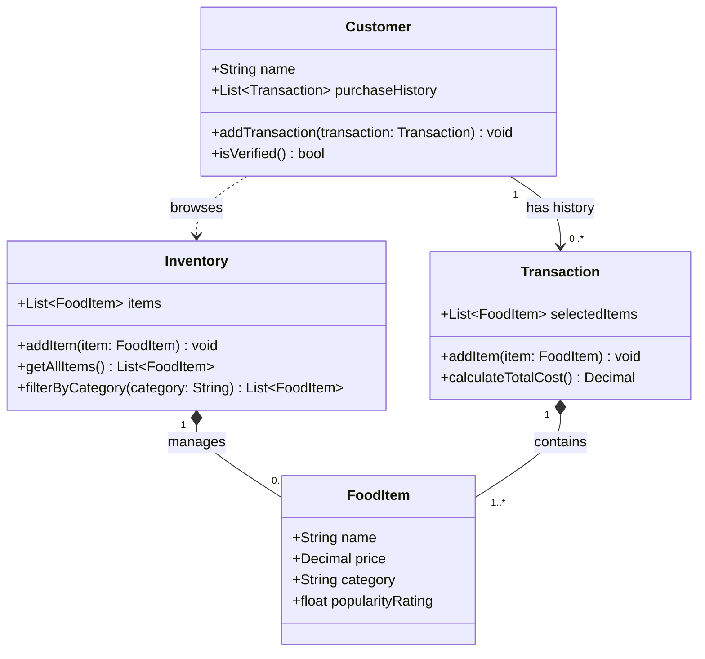

# ByteBites Final UML Design

## Revised Class Diagram

## Comparison to Prior Draft

- Keeps exactly the four requested classes with the original required relationships preserved.
- Removes extra helper methods and constructors so behavior stays strictly within the feature request scope.
- Uses explicit visibility and typed signatures in Mermaid `classDiagram`, reflecting a focused design-agent style instead of broader “helpful extras.”
