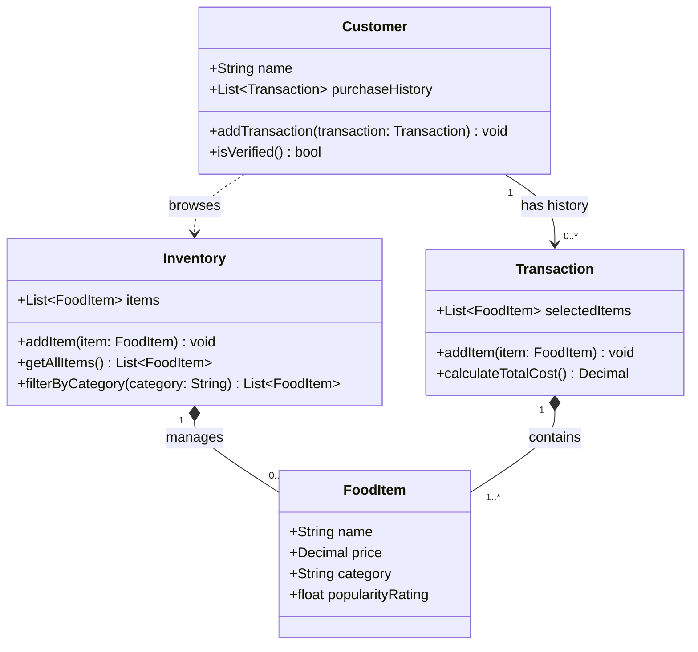

# ByteBites Final UML Design

## UML Class Diagram (ASCII)

```text
+---------------------------+            +--------------------------------+
|         Customer          |            |          Transaction           |
+---------------------------+            +--------------------------------+
| +name: String             |1        0..*| +selectedItems: List<FoodItem> |
| +purchaseHistory:         |----------->| +addItem(item: FoodItem): void |
|   List<Transaction>       | has history| +calculateTotalCost(): Decimal |
| +addTransaction(          |            +--------------------------------+
|   transaction: Transaction)|                        |
|   : void                  |                     1..* (contains)
| +isVerified(): bool       |                        v
+---------------------------+               +-----------------------------+
  . . . . . . . . . . . . . . . . . . . .  |          FoodItem           |
  . browses                                  +-----------------------------+
  .                                          | +name: String               |
  v                                          | +price: Decimal             |
+---------------------------+                | +category: String           |
|         Inventory         |1           0..*| +popularityRating: float    |
+---------------------------+*-------------->|                             |
| +items: List<FoodItem>    |   manages      +-----------------------------+
| +addItem(item: FoodItem): |
|   void                    |
| +getAllItems():           |
|   List<FoodItem>          |
| +filterByCategory(        |
|   category: String):      |
|   List<FoodItem>          |
+---------------------------+
```

## Mermaid Source (Preview)


